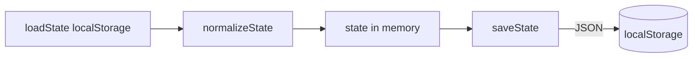

# 02. 데이터 모델·영속화·Zod 매핑

`app.js`의 `state` 구조와 정규화 규칙을 정리하고, Zod·TypeScript로 옮길 때의 매핑을 정의합니다.

## 영속화

- **키:** `localStorage` → `STORAGE_KEY = "tdw-prototype-v6"`
- **형식:** `JSON.stringify(state)` 단일 객체
- **로드:** 파싱 실패 또는 없음 → `createSeedData()`

## 최상위 `state` 스키마

```ts
// 개념적 형태 (실제 필드명은 app.js와 동일)
type AppState = {
  ui: UiState
  project: ProjectState
  domains: Domain[]
  items: Item[]
  comments: Comment[]
  history: HistoryEntry[]
}
```

### `ui`

| 필드 | 타입 | 설명 |
|------|------|------|
| `activeView` | string | `"dashboardView"` \| `"workspaceView"` \| `"itemsView"` \| `"itemTreeView"` |
| `activeWorkspace` | string | `"information_request"` \| `"decision"` |
| `selectedItemId` | string \| null | Items 상세 선택 |
| `expandedDomainIds` | string[] | 트리 펼침 도메인 id |
| `itemsQuery` | string | Items 검색 (구 `searchQuery` 병합) |
| `treeQuery` | string | 트리 검색 |
| `treePreviewItemId` | string | 트리에서 펼친 프리뷰 아이템 id |
| `treeManageDomainId` | string | 정규화 시 존재하는 도메인 id로 보정 |

### `project`

| 필드 | 타입 |
|------|------|
| `id` | string |
| `name` | string |
| `subtitle` | string |

### `Domain`

| 필드 | 타입 | 설명 |
|------|------|------|
| `id` | string | 고유 |
| `name` | string | 표시명 |
| `parentId` | string | 루트는 `""` |
| `order` | number | 형제 간 순서 |

**정규화 (`normalizeDomains`):**

- `id` 중복 시 재발급
- `parentId`가 자기 자신이거나 무효하면 `""`
- 부모 체인 순환 시 `parentId` 제거
- 트리 순회로 `order` 재부여 (형제 정렬: order → 이름 ko)

### `Item`

| 필드 | 타입 | 설명 |
|------|------|------|
| `id` | string | 보통 `code`와 동일하게 사용 |
| `code` | string | 사람이 읽는 코드 |
| `type` | enum | 아래 참고 |
| `domain` | string | Domain `id` |
| `title` | string | |
| `description` | string | |
| `priority` | `"P0"` \| `"P1"` \| `"P2"` | |
| `status` | `"논의"` \| `"방향합의"` \| `"확정"` | 정규화됨 |
| `owner` | string | |
| `dueDate` | string | `YYYY-MM-DD` 권장, 빈 문자열 가능 |
| `clientResponse` | string | |
| `finalConfirmedValue` | string | 레거시 `agreedValue` 병합 |
| `isLocked` | boolean | `status === "확정"` 또는 명시 잠금과 동기 |
| `createdAt` | string (ISO) | |
| `updatedAt` | string (ISO) | |

**아이템 타입 (`type`):**

- `information_request`, `decision`, `review`, `issue`, `change_request`

**로드 시 (`normalizeState`):**

- `status` → `normalizeStatusValue`
- `domain` → `ensureDomainExistsByValue`로 기존 도메인에 맵 또는 신규 추가
- `finalConfirmedValue` ← `finalConfirmedValue` 또는 `agreedValue`
- `isLocked` ← 확정 상태 또는 기존 `isLocked`

### `Comment`

| 필드 | 타입 |
|------|------|
| `id` | string |
| `itemId` | string |
| `author` | string |
| `body` | string |
| `createdAt` | string (ISO) |

### `HistoryEntry`

| 필드 | 타입 |
|------|------|
| `id` | string |
| `itemId` | string |
| `eventType` | string |
| `summary` | string |
| `actor` | string |
| `createdAt` | string (ISO) |

## 상태 흐름(개념)



## Zod 매핑 제안

레이어별로 스키마를 나누면 마이그레이션·import 검증이 쉬움입니다.

1. **원시 저장 스키마 `PersistedStateSchema`**  
   - `unknown` 필드 허용 여부: 초기에는 `.passthrough()` 또는 `.strip()`으로 구버전 호환 결정.
2. **도메인 엔티티 `DomainSchema`**  
   - `parentId` 기본 `""`, `order` 정수.
3. **아이템 엔티티 `ItemSchema`**  
   - `status`는 `z.enum(["논의", "방향합의", "확정"])` + `.transform`으로 레거시 문자열 수용 시 별도 파이프.
4. **UI 서브스키마 `UiStateSchema`**  
   - `expandedDomainIds`는 `z.array(z.string())`.

**정규화 함수:** Zod의 `parse`만으로 부족한 부분(도메인 트리 order, 순환 제거)은 `entities` 레이어의 `normalizeAppState(state: unknown): AppState` 같은 **순수 함수**로 유지하는 것이 현재 `normalizeState`와 동등합니다.

## Import 행 → Item 후보 필드

일괄등록에서 사용하는 논리적 키(헤더 alias는 `HEADER_ALIASES` 참고):

| 논리 키 | Item 필드 |
|---------|-----------|
| code | `code` (없으면 생성 시 자동) |
| type | `type` |
| domain | 도메인 문자열 → id 해석 |
| title | `title` (필수) |
| description | `description` |
| priority | `P0`/`P1`/`P2`, 기본 `P1` |
| status | 정규화 후 3값 |
| owner | `owner` |
| dueDate | `normalizeDateInput` |
| clientResponse | `clientResponse` |
| finalConfirmedValue | `finalConfirmedValue` |

Zod로는 **`ImportRowSchema`**(느슨한 입력)와 **`NormalizedImportItemSchema`**(저장 직전) 두 단계를 권장합니다.

## 버전 정책 권장

- `state`에 선택 필드 `schemaVersion: number`를 추가하고, 로드 시 분기하면 이후 필드 추가가 안전합니다.
- UI 표기 버전과 `STORAGE_KEY` 접미사를 통일하세요 (v6 / v7 혼선 방지).
