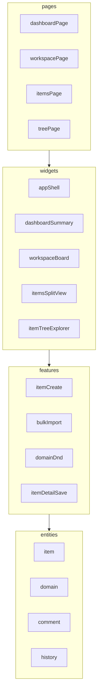

# 03. Feature-Sliced Design 매핑 제안

**관점별 분리(공용 UI·유틸·훅·비즈니스 로직 판별):** [07-layering-extraction.md](./07-layering-extraction.md)

목표 구조는 **FSD 공식 레이어**(`app`, `pages`, `widgets`, `features`, `entities`, `shared`)를 따릅니다. 아래는 현재 `app.js` 책임을 나누는 **이동 표**입니다.

## 레이어 역할 요약

| 레이어 | 역할 |
|--------|------|
| `app` | Vite 엔트리, 라우터, 글로벌 프로바이더, 스타일 임포트, `localStorage` 부트스트랩 |
| `pages` | 라우트 단위 조합(대시보드 페이지, 워크스페이스 페이지 등) |
| `widgets` | 여러 feature를 묶은 큰 UI(대시보드 그리드, 칸반 보드, 트리 패널) |
| `features` | 사용자 시나리오 단위(아이템 저장, 확정 토글, 코멘트 추가, CSV import, 도메인 DnD) |
| `entities` | 비즈니스 엔티티 모델·UI 조각·selector( Item, Domain, Comment, History ) |
| `shared` | UI 킷, 유틸, 상수, API 어댑터(공용) |

**의존 규칙:** 상위 레이어는 하위만 import (예: `pages` → `widgets` → `features` → `entities` → `shared`).

---

## `shared`

| 슬라이스 | 내용 |
|----------|------|
| `shared/lib` | `normalizeKey`, `escapeHtml` 대체 정책, 날짜/CSV 파서, `uniqueId`, `clone` |
| `shared/config` | `STORAGE_KEY`, 라우트 경로 상수 |
| `shared/ui` | Shadcn 래퍼 재export, 레이아웃(선택) |
| `shared/constants` | `TYPE_LABELS`, `PRIORITY_LABELS`, `STATUS_VALUES`, `WORKSPACE_CONFIG`, `BASE_DOMAIN_DEFS`, `HEADER_ALIASES`, alias 맵들 |

---

## `entities`

비즈니스 데이터와 직결된 **타입, 정규화, 표시용 작은 컴포넌트**를 둡니다.

| 슬라이스 | 책임 (현재 코드 기준) |
|----------|------------------------|
| `entities/item` | Item 타입, `getItems` 정렬, `getItemById`, `getNextCode`, 상태 라벨·pill 스타일 |
| `entities/domain` | Domain 타입, `normalizeDomains`, `getDomains`, `getDomainPathLabel`, depth/option 라벨 |
| `entities/comment` | Comment 타입, `getComments` |
| `entities/history` | History 타입, `getHistory`, `addHistory` 시그니처 |
| `entities/project` | `project` 객체 (사이드바 등) |

**참고:** 전역 단일 `state`를 쓸 경우, 업데이트 함수는 `features` 또는 `app/store`에 두고 `entities`는 **순수 함수 + selector**만 유지하는 편이 FSD에 잘 맞습니다.

---

## `features`

| 슬라이스 | 사용자 시나리오 | 현재 함수·영역 |
|----------|-----------------|----------------|
| `features/switch-view` | 네비게이션, `activeView` | `switchView`, nav 클릭 |
| `features/workspace-tab` | 칸반 유형 탭 | `activeWorkspace`, workspace tabs |
| `features/items-filters` | 검색·셀렉트 필터 | `getFilteredItems`, `setSearchQuery` |
| `features/item-detail-save` | 상세 저장 | `saveSelectedItem` |
| `features/item-lock-toggle` | 확정/해제 | `toggleLockSelectedItem` |
| `features/item-comment` | 코멘트 추가 | `addComment` |
| `features/item-create` | 모달에서 생성 | `createItem`, `openModal` |
| `features/item-delete` | 트리에서 삭제 | `deleteItem` |
| `features/domain-crud` | 생성·이름변경·삭제·하위 추가 | `createDomain`, `renameDomain`, `deleteDomainNode`, `createChildDomain` |
| `features/domain-dnd` | 도메인 트리 DnD | `moveDomainNode`, `applyDomainDropPosition`, dropzones |
| `features/item-dnd` | 아이템을 도메인으로 이동 | `moveItemToDomain` |
| `features/tree-search` | 트리 검색 상태 | `treeQuery`, `renderTreeExplorer` 필터 |
| `features/bulk-import` | CSV/붙여넣기 미리보기·실행 | `prepareImport`, `executeImport`, `downloadTemplateCsv` |
| `features/export-state` | JSON 다운로드 | `exportJson` |
| `features/reset-seed` | 샘플 초기화 | `resetData` |

---

## `widgets`

| 위젯 | 구성 |
|------|------|
| `widgets/app-shell` | 사이드바 + 메인 레이아웃 + 탑바 슬롯 |
| `widgets/dashboard-summary` | 통계 카드 + P0 목록 + 도메인 진행 테이블 + 최근 히스토리 |
| `widgets/workspace-board` | 탭 + 메타 + 칸반 컬럼 |
| `widgets/items-split-view` | 필터 바 + 목록 + 상세(폼·코멘트·히스토리) |
| `widgets/item-tree-explorer` | 툴바 + 요약 바 + 트리 본문 |

---

## `pages`

라우팅 전략 예시(URL은 프로젝트에 맞게 조정):

| 페이지 | 경로 예시 | 위젯·비고 |
|--------|-----------|-----------|
| Dashboard | `/` 또는 `/dashboard` | `dashboard-summary` |
| Workspaces | `/workspaces` | `workspace-board` |
| Items | `/items` | `items-split-view`, 쿼리 `?id=` 선택적 |
| Item Tree | `/tree` | `item-tree-explorer` |

단일 페이지에서 탭만 쓸 경우에도 **폴더는 `pages`로 유지**하고 내부에서 탭 상태만 바꿔도 됩니다.

---

## `app`

- `main.tsx` / `App.tsx`: QueryClient, Theme, Router
- **상태 저장소:** `localStorage` 구독은 한 곳에만 (예: Zustand `subscribe` 또는 커스텀 훅 `usePersistedStore`)
- `renderAll`에 해당하는 것은 **선택적 `useEffect` 배치를 피하고**, 파생 데이터는 `useMemo` / selector로 계산

---

## `app.js` → 슬라이스 대응 요약

이 매핑은 **필수 단일 방식이 아니라** 팀 규모에 따라 `features`를 세분화하거나 일부를 `widgets` 내부로 접을 수 있습니다. 다만 **entities에 비즈니스 규칙을 모으고**, UI 이벤트는 **features**에 두는 패턴을 권장합니다.
