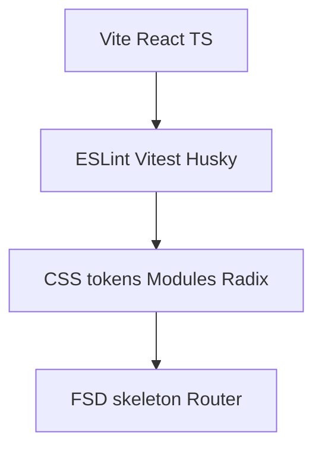

# 마이그레이션 실행 플랜 (환경 구성 우선)

Cursor 플랜과 동기화한 실행 순서 문서입니다. 상세 선행 문서는 아래 인덱스를 따릅니다.

**개요:** [README.md](./README.md) 로드맵과 [07-layering-extraction.md](./07-layering-extraction.md) 추출 순서를 따르되, **Turborepo 모놀레포에서 레거시(vanilla)와 신규 앱을 병행 관리**하고, 스타일은 **Tailwind 없이 CSS 변수(디자인 토큰) + CSS Modules**로 고정한 뒤, 툴체인·Vite·TS·FSD 뼈대를 선행하고 화면 포팅을 진행합니다.

## 진행 체크리스트 (플랜 todo)

- [ ] Phase 0: Turborepo 루트(workspaces, turbo.json), apps/legacy로 기존 정적 앱 이전
- [ ] Phase 1: apps/web에 Vite+React+TS, 경로 별칭
- [ ] Phase 2~3: ESLint·Prettier·Husky·lint-staged, CSS 토큰·global base, CSS Modules·Radix
- [ ] Phase 4: FSD 디렉터리 + 라우터·app 엔트리
- [ ] Phase 5: 타입·Zod·constants·shared/lib·localStorage·스토어
- [ ] Phase 6: Items→Dashboard/Workspace→Tree→모달→글로벌·a11y
- [ ] Phase 7: Vercel(앱별 루트)·turbo build·완료 후 apps/legacy 제거

---

참고 문서: [README.md](./README.md), [02-data-model.md](./02-data-model.md), [03-fsd-mapping.md](./03-fsd-mapping.md), [04-ui-and-styles.md](./04-ui-and-styles.md), [05-forms-validation.md](./05-forms-validation.md), [06-risks-and-testing.md](./06-risks-and-testing.md), [07-layering-extraction.md](./07-layering-extraction.md).

---

## Phase 0 — 환경·저장소 전제

- **Node:** LTS(예: 20.x) 고정 — `.nvmrc` 또는 `engines` in `package.json` (선택).
- **레거시 유지:** 마이그레이션 중에는 루트 `index.html` / `app.js` / `styles.css`를 참고용으로 두고, 새 앱은 **별도 루트**로 두는 방식을 권장합니다.
  - **권장 A:** 저장소 루트에 Vite 앱 생성 → `src/`가 React, 기존 정적 파일은 나중에 제거 ([README 마이그레이션 완료 후 정리](./README.md) 참고).
  - **권장 B:** `apps/web` 등 서브폴더로 새 앱 (모노레포 확장 시).

---

## Phase 1 — Vite + React + TypeScript 스캐폴딩

- `npm create vite@latest` — 템플릿: **React + TypeScript**.
- `package.json`에 `dev`, `build`, `preview` 스크립트 확인.
- **절대 경로 별칭:** `vite.config.ts` + `tsconfig`에 `@/` → `src/` (또는 FSD용 `@app`, `@pages` 등 팀 컨벤션 단일화). 이후 컴포넌트·모듈 CSS import 일관성에 필수.

---

## Phase 2 — 품질 도구 (환경의 일부로 선행 권장)

- **ESLint** (`eslint-plugin-react-hooks`, `@typescript-eslint`).
- **Prettier** (선택, 팀 규칙과 `.cursor/code-styling/general-typescript-code-style.mdc` 정렬).
- **Vitest** + `jsdom` (선택): [06-risks-and-testing.md](./06-risks-and-testing.md)에서 권장한 순수 함수 이전 시점에 도입.

### Husky · pre-commit

- 루트 `husky`, `lint-staged`, `"prepare": "husky"`.
- `.husky/pre-commit`에서 `lint-staged`.
- `lint-staged`: `*.{ts,tsx}` → `eslint --fix`; Prettier 사용 시 `*.{ts,tsx,js,jsx,json,css,md}` → `prettier --write`.
- `tsc --noEmit`은 CI 또는 `pre-push` 권장.
- Turborepo: Husky·lint-staged는 **저장소 루트**.

---

## Phase 3 — 스타일: CSS 토큰 + CSS Modules (Tailwind 미사용)

- **토큰:** `tokens.css` 등에 `--color-*`, `--space-*` 정의; 레거시 `styles.css` 값 이전.
- **Modules:** 슬라이스별 `*.module.css`에서 `var(--token)` 사용.
- **UI:** shadcn은 Tailwind 의존 → **Radix Primitives + CSS Modules** 권장. ([04-ui-and-styles.md](./04-ui-and-styles.md)는 팀 결정에 맞게 재해석.)

---

## Phase 4 — FSD 폴더 뼈대 + 라우팅

- `src/` 아래: `app/`, `pages/`, `widgets/`, `features/`, `entities/`, `shared/` ([03-fsd-mapping.md](./03-fsd-mapping.md)).
- React Router v6 등으로 URL 전략 확정.

---

## Phase 5 — 데이터 계층

[07-layering-extraction.md](./07-layering-extraction.md) 순서: 타입·상수·순수 유틸 → Zod → `localStorage` 어댑터 → 스토어 ([02-data-model.md](./02-data-model.md)).

---

## Phase 6 — 화면 포팅

[01-current-features.md](./01-current-features.md) 체크리스트. Items → Dashboard/Workspaces → Tree → 모달 → 글로벌 액션 → a11y.

---

## Phase 7 — 배포·레거시 제거

`vercel.json`, SPA `rewrites` ([06-risks-and-testing.md](./06-risks-and-testing.md)). 완료 후 레거시 파일·`apps/legacy` 제거.

---

## 의사결정 (실행 전)

- 새 앱 위치: 루트 Vite vs `apps/web` — Phase 0에서 확정.
- 패키지 매니저: pnpm vs npm/yarn (Turborepo와 CI 정렬).
